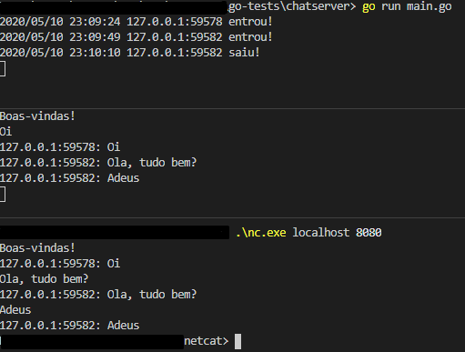

# Chat Server

Um servidor de chat bem simples que lida com diversas conexões e replica as mensagems enviadas de um cliente para os outros. É um bom meio de entender o uso de goroutines.

## Exemplo

